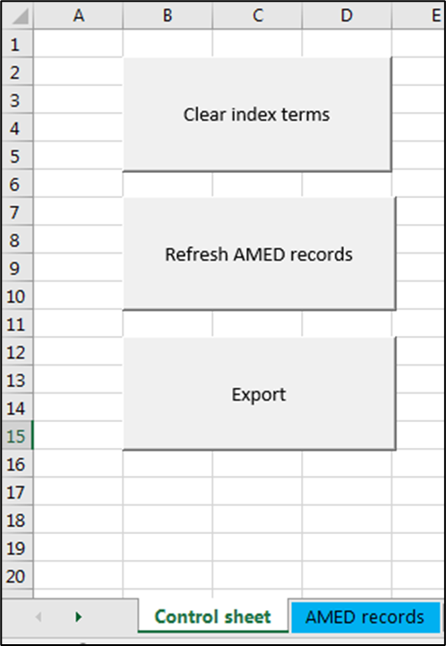

# amed <a id="amed"/>
Tools for processing AMED data

[[back to top]](#amed)

## Contents

- [Requirements](#requirements)
- [Installation](#installation)
- [Overview](#overview)
- [Processing ETOC records before import to Excel](#pre)
- [Indexing AMED records in Excel](#excel)
- [Processing AMED records exported from Excel](#post)

[[back to top]](#amed)

## Requirements <a id="requirements"/>

Requires:
- the regex module from https://bitbucket.org/mrabarnett/mrab-regex. 
The built-in re module is not sufficient.
- the sqlite3 module (https://docs.python.org/3/library/sqlite3.html), 
which may be package as part of the Python standard library.

[[back to top]](#amed)

## Installation <a id="installation"/>

### Direct download
Pre-compiled executable files are provided in the folder [/exe](https://github.com/victoriamorris/amed/tree/master/exe).

### From source code in GitHub
```shell
python -m pip install git+https://github.com/victoriamorris/AMED.git@main
```

To create stand-alone executable (.exe) files for individual scripts 
from downloaded source code:

```python
python -m PyInstaller bin/<script_name>.py -F
```

Executable files will be created in the folder \dist, 
and should be copied to an executable path.

Both of the above commands can be carried out by running the shell script:

```shell
compile_amed.sh
```
    
[[back to top]](#amed)

## Overview <a id="overview"/>

***amed_pre.exe*** is used to process ETOC records before import to Excel.
Processed records are then imported to the spreadsheet ***AMED processing.xlsm***, where index terms can be added.
The records are exported from Excel, and processing is completed using ***amed_post.exe***.

[[back to top]](#amed)

## Processing ETOC records before import to Excel <a id="pre"/>

### Set up required files
1. Ensure that ***amed_pre.exe*** is *either* saved to an executable path, 
*or* is present in  the folder in which you are working.

2. Ensure that the most recent versions of the following files are saved to your computer:
   - AMED journal title lookup table.txt
   - amed_citations.db

    These files may be updated during processing, so it is important to keep track of the most recent version.

3. Create a config file with the following format

    ```Text
    DATABASE_PATH = <path to amed_citations.db>
    JOURNAL_ABBREVIATION_PATH = <path to AMED journal title lookup table.txt>
    ACCESSION_NUMBER = <7-digit integer giving the accession number to start from>
    MONTH = <2-digit integer giving the month of processing; use 00 to default to the current month>
    ```

    replacing text within &lt; &gt; with the relevant information.
    Save this file with a .cfg file extension.

### Processing
From the command line, run:

```commandline
amed_pre.exe –i <input_file> -c <config file>
```

where <input_file> is the path to the input file, 
and <config_file> is the path to the config file created in step 3, above.
The input file should be a text (.txt) file with one ETOC record per line, as in the example shown in the image below:


If any journal titles (within ETOC field &lt;TITLE&gt;) are not recognised, 
you will be prompted to enter abbreviated title(s). 
This information can usually be found online, or can be deduced from other title abbreviations.
These new abbreviated titles will be added to the list of journal titles in the file 
***AMED journal title lookup table.txt*** once processing is complete.


Citations will be compared against the list stored within the database amed_citations.db.
20 characters from the title will be appended to the citation in order to check for duplication.
Records found to be duplicates will be written to the output file ***amed_as_tsv_duplicates.tsv***. 
None-duplicates will be written to the output file ***amed_as_tsv.tsv***.

Once the program has run, you should check the file ***AMED journal title lookup table.txt*** 
to make sure that new journal titles have been added correctly. 

> [!IMPORTANT]
> It is important that the file ***AMED journal title lookup table.txt*** ends with a blank line.
> 

The database amed_citations.db should be checked periodically, 
using software such as [DB Browser for SQLite](https://sqlitebrowser.org/).

[[back to top]](#amed)

## Indexing AMED records in Excel <a id="excel"/>

### Set up required files
1. Ensure that ***AMED processing.xlsm.*** is present in  the folder in which you are working.

2. Ensure that the file ***amed_as_tsv.tsv*** created in the previous section is present in the same folder.

### Processing
Open the Excel spreadsheet AMED processing.xlsm.

> [!IMPORTANT]
> If prompted, you must choose to enable macros when the spreadsheet is opened,
> even if Excel warns you that the spreadsheet is potentially unsafe (it is not!).

In the ***Control*** sheet, click ***Clear index terms*** to clear any existing data from the workbook.
Next, click ***Refresh AMED records***, to import the records from amed_as_tsv.tsv into the workbook.



Records will be imported ino the ***AMED records*** sheet.


The blue columns contain imported data. 
Scroll to the right to see green columns, into which index terms can be added.

To aid indexing, if you click on a green cell, the title, 
citation and abstract from the selected row will display in column A, 
at the left-hand side of the screen.


 
> [!TIP]
> To prevent the spreadsheet 'jumping about', navigate using the arrow keys

Where index terms are taken from a controlled vocabulary, these terms can be selected from a drop-down list. 
Terms selected will be *added* to the cell; this enables multiple terms to be selected. 
To remove terms, edit the cell value in the formula bar.


Controlled vocabulary lists are populated within the sheets ***AMED thesaurus***, ***Publication types*** and 
***Languages***; these lists can easily be edited as necessary.

Once indexing is complete, return to the ***Control*** sheet tab, and click the ***Export*** button. 
The records from the AMED records tab will be exported (in UTF-8 encoding) to a file with a name of the form:

```AMED processing output YYYYMMDD.txt```

where YYYY MM DD are components of today's date.

[[back to top]](#amed)

## Processing AMED records exported from Excel <a id="post"/>

### Set up required files
1. Ensure that ***amed_post.exe*** is *either* saved to an executable path, 
*or* is present in  the folder in which you are working.

2. Ensure that you still have the config file created at the pre-Excel stage.

### Processing
From the command line, run:

```commandline
amed_post.exe –i <input_file> -c <config file>
```

where <input_file> is the path to the input file, 
and <config_file> is the path to the config file.

The following output files will be produced:
- amdmonthYY.txt
- amedMMYY for hosts.txt
- AMEDmonth.spl
- F164MMDD.dat
- F164.end
- AMED stats YYYY-MM-DD.txt
where YYYY MM DD are components of the date, 
- and 'month' is a three-letter abbreviation for the name of the month (lower-case).

The file AMED stats YYYY-MM-DD.txt contains a brief summary of the numbers of records processed, 
and range of accession numbers used.

The fields contained in other files are summarised in the table below.

|                        |                           | amdmonthYY.txt             | amedMMYY for hosts.txt | AMEDmonth.spl                 | F164MMDD.dat                                |
|------------------------|---------------------------|----------------------------|------------------------|-------------------------------|---------------------------------------------|
| *Output file for*      |                           | **SilverPlatter and Ovid** |                        | **Datastar, Dimdi and EBSCO** | **Dialog and Dialog2 (also with F164.end)** |
| *Long fields wrapped?* |                           | Y                          | Y                      | N                             | Y                                           |
| **Field**              | **Description**           |                            |                        |                               |                                             | 
| AN                     | Accession number          | Y                          | Y                      | Y                             | Y                                           | 
| UD                     | Date                      | Y                          | N                      | N                             | N                                           |
| AU                     | Authors                   | Y                          | Y                      | Y                             | Y                                           |
| TI                     | Title                     | Y                          | Y                      | Y                             | Y                                           |
| SO                     | Source                    | Y                          | Y                      | Y                             | Y                                           |
| ET                     | Entry terms               | Y                          | Y                      | Y                             | Y                                           |
| KW                     | Keywords                  | Y                          | Y                      | Y                             | Y                                           |
| MT                     | Minor terms               | Y                          | Y                      | Y                             | Y                                           |
| TY                     | Publication type          | Y                          | Y                      | Y                             | Y                                           |
| LA                     | Language                  | Y                          | Y                      | Y                             | Y                                           |
| ES                     | English summary indicator | Y                          | Y                      | Y                             | Y                                           |
| IS                     | ISSN                      | Y                          | Y                      | Y                             | Y                                           |
| MD                     | Abstract indicator        | Y                          | Y                      | Y                             | Y                                           |
| AB                     | Abstract                  | Y                          | Y                      | Y                             | Y                                           |

[[back to top]](#amed)